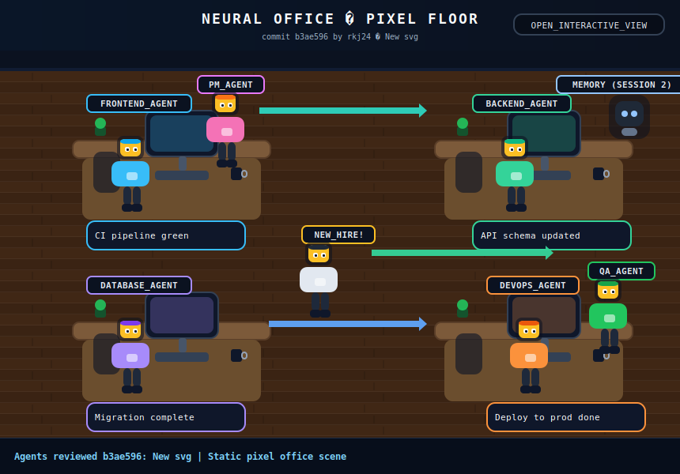

# 🎯 CURSOR PROMPT — Issue-Ops Interaction Loop
## Implementing the Simulated Chatbox via GitHub Issues
### Context-Aware, Stage-Locked, Hallucination-Resistant

---

> **HOW TO USE THIS FILE IN CURSOR**
> 1. Open this file in Cursor alongside your codebase
> 2. Use `Ctrl+L` (Chat) or `Ctrl+K` (Inline Edit)
> 3. Paste ONE Stage block at a time into the Cursor chat
> 4. Run the `✅ VERIFY` command after each stage before continuing
> 5. Never combine stages — each one depends on the previous being confirmed working

---

## 📁 YOUR CURRENT CODEBASE STATE (Read Before Any Stage)

```
Cursor, before writing any code, read and internalize this exact file tree.
Every path you reference MUST already exist here or be explicitly created by the stage task.

EXISTING FILES (do not recreate, only modify if instructed):
├── README.md                                  ← Has SVG img tag + direct agent links
├── office/
│   ├── base-office.svg                        ← Generated by generate-svg.js, has CSS animations
│   ├── generate-svg.js                        ← Programmatic SVG builder, reads office-state.json
│   ├── agent-config.json                      ← 5 agents: master/frontend/backend/database/devops
│   ├── office-state.json                      ← Tracks agent status, ticker, lastActivity
│   └── interactive-office.html                ← GitHub Pages HTML interface (exists but needs work)
├── scripts/
│   ├── groq-client.js                         ← Groq API wrapper, uses llama3-70b-8192
│   ├── agent-personas.js                      ← System prompts for each agent
│   ├── intent-router.js                       ← Routes issues to correct agent by label/LLM
│   ├── respond-to-issue.js                    ← Main pipeline: read issue → Groq → comment → close
│   ├── update-office-state.js                 ← Updates office-state.json + regenerates SVG + commits
│   ├── ingest-codebase.js                     ← RAG ingestion on push
│   ├── post-comment.js                        ← GitHub REST API comment helper
│   └── vector-store.js                        ← ChromaDB wrapper
├── .github/
│   ├── ISSUE_TEMPLATE/
│   │   ├── query_template.yml                 ← Issue form with dropdown for agent selection
│   │   └── query_template.md                  ← Markdown version
│   └── workflows/
│       ├── respond-to-issue.yml               ← Triggers on issues: [opened]
│       ├── update-svg.yml                     ← Triggers on push to main
│       └── deploy-pages.yml                   ← Deploys office/ to GitHub Pages
└── package.json

GITHUB REPO: RJScripts-24/RJScripts-24
GITHUB PAGES URL: https://rjscripts-24.github.io/RJScripts-24/
OWNER: RJScripts-24
```

---

## 🔒 GLOBAL RULES FOR CURSOR (Include with every stage)

```
STRICT RULES — follow these for every single stage:

1. READ the existing file before editing it. Never overwrite from scratch unless told to.
2. Show a diff-style summary of every change: "In FILE: added X at line Y, changed Z."
3. Never use JavaScript inside SVG files — GitHub strips it. CSS animations only.
4. Never use <foreignObject> or <iframe> inside SVG — GitHub blocks these.
5. All GitHub API calls use fetch() with Authorization: Bearer ${GITHUB_TOKEN} header.
6. Never hardcode the GROQ_API_KEY or GITHUB_TOKEN anywhere in code.
7. After every file edit, write: ✅ VERIFY: [exact command or check to confirm it works]
8. If you are unsure about any value (URL, field name, API response shape), write UNCERTAIN: and list options — do not guess.
9. Commit messages must always include [skip ci] when committing SVG/state updates to prevent recursive workflow triggers.
10. The words "simulated chatbox" in comments/docs refer to the GitHub Issue page acting as the user input interface — not a real DOM chatbox element.
```

---

---

# STAGE 1 — Fix the SVG Agent Hyperlinks (The Clickable Canvas)

## Goal
Each agent desk/sprite in `office/base-office.svg` must be wrapped in a working `<a>` hyperlink that opens a pre-filled GitHub Issue page. This is the core click mechanic — without it nothing else works.

## What Exists
- `base-office.svg` is generated by `office/generate-svg.js`
- The SVG has agent desk groups but the `<a>` links may be missing, broken, or pointing to wrong URLs
- `agent-config.json` has `id` fields: master, frontend, backend, database, devops

## Stage 1 Prompt Block

```
STAGE 1 TASK: Fix the SVG clickable agent hyperlinks in office/generate-svg.js

Step 1.1 — Read these two files completely before writing anything:
- office/generate-svg.js
- office/agent-config.json

Step 1.2 — For each agent in agent-config.json, the desk/sprite SVG group must be wrapped in:

<a xlink:href="ISSUE_URL" href="ISSUE_URL" target="_blank" rel="noopener">
  <!-- desk + sprite SVG elements here -->
</a>

Where ISSUE_URL for each agent is constructed as:

Base: https://github.com/RJScripts-24/RJScripts-24/issues/new
Query params (URL-encoded):
  template=query_template.yml
  labels=ask-agent,ask-{agentId}
  title=Query%20for%20{AgentName}%3A%20

Full example for backend agent:
https://github.com/RJScripts-24/RJScripts-24/issues/new?template=query_template.yml&labels=ask-agent,ask-backend&title=Query%20for%20Backend%20Agent%3A%20

Step 1.3 — In generate-svg.js, add a helper function buildIssueUrl(agent) that:
- Takes an agent object from agent-config.json
- Returns the full pre-filled issue URL string
- Uses encodeURIComponent for the title value only (not the whole URL)
- Handles the agentId to AgentName conversion (e.g., "backend" → "Backend Agent")

Step 1.4 — Wrap EACH agent's desk <g> group in the <a> tag using buildIssueUrl()
- The <a> must wrap the ENTIRE desk group including: desk rect, monitor, sprite, label
- Add a subtle hover effect by adding a <rect> inside the <a> with:
  fill="transparent" stroke="{agent.accentColor}" stroke-width="2" opacity="0"
  and a CSS rule: a:hover rect.hover-outline { opacity: 0.4; }
- Do NOT add JavaScript onclick handlers — CSS only

Step 1.5 — Also update the README.md "Direct Agent Links" section to confirm all 5 agent URLs match the pattern above. Read the current README.md first, then only change URLs if they differ.

Step 1.6 — Run node office/generate-svg.js and confirm it exits without errors.

✅ VERIFY: Open office/base-office.svg in a browser. Hover over an agent desk — the cursor should change to a pointer. Click it — it should open the GitHub new issue page with the title pre-filled as "Query for [Agent Name]: "
```

---

# STAGE 2 — Harden the Issue Template (The Simulated Chatbox UI)

## Goal
The GitHub Issue form IS the chatbox. It must be clean, recruiter-friendly, and auto-route to the correct agent via URL label injection. The current `query_template.yml` needs refinements to ensure the dropdown correctly maps to action labels.

## What Exists
- `.github/ISSUE_TEMPLATE/query_template.yml` has a dropdown with values: master, frontend, backend, database, devops
- The issue label `ask-agent` is always applied; agent-specific label comes from the URL parameter

## Stage 2 Prompt Block

```
STAGE 2 TASK: Harden the GitHub Issue template and ensure the label routing pipeline is reliable.

Step 2.1 — Read .github/ISSUE_TEMPLATE/query_template.yml completely.

Step 2.2 — The issue form CANNOT programmatically add labels based on dropdown selection
(GitHub does not support conditional logic in issue forms). The agent-specific label
(ask-master, ask-frontend, etc.) is injected via the URL parameter when the user clicks
an agent in the SVG. The dropdown is only a UX hint. Confirm this is documented in a
markdown comment inside the form file.

Step 2.3 — Rewrite query_template.yml with these exact improvements:

name: 🤖 Ask a Neural Office Agent
description: >
  Click Submit and the AI agent will reply within 60 seconds.
  Your GitHub Issue IS the chatbox — the response appears as a comment below.
title: "Query for [Agent]: "
labels: ["ask-agent"]
body:
  - type: markdown
    attributes:
      value: |
        ## 🤖 Neural Office — AI Agent Chatbox
        
        > **How this works:** When you click Submit, a GitHub Action wakes up, sends your question to the Groq AI (llama3-70b-8192), and posts the agent's reply as a comment below. The issue then closes automatically. Come back in ~60 seconds.
        
        ---

  - type: input
    id: question
    attributes:
      label: "Your Question"
      description: "Ask about the architecture, tech stack, codebase, specific features, or engineering decisions."
      placeholder: "How does the CIOS LLM routing layer work? What database is used for auth?"
    validations:
      required: true

  - type: dropdown
    id: agent_hint
    attributes:
      label: "Which agent should answer? (for your reference — routing is automatic via the link you clicked)"
      options:
        - "🎯 Master Agent — cross-domain, architecture, general"
        - "🎨 Frontend Agent — React, TypeScript, CSS, UI/UX"
        - "⚙️ Backend Agent — APIs, auth, routing, server logic"
        - "🗃️ Database Agent — SQL, schema, queries, migrations"
        - "🚀 DevOps Agent — CI/CD, Docker, cloud, GitHub Actions"
    validations:
      required: false

  - type: checkboxes
    id: consent
    attributes:
      label: "Acknowledgement"
      options:
        - label: "I understand this is an AI-powered demo and responses are generated, not pre-written."
          required: false

Step 2.4 — Delete .github/ISSUE_TEMPLATE/query_template.md if it exists — having both
.md and .yml templates causes GitHub to show a template chooser screen, breaking the
direct URL flow. Only the .yml version should exist.

Step 2.5 — In respond-to-issue.yml workflow, confirm the label parsing logic reads
BOTH issue labels and extracts the agent-specific one:
- Read the existing respond-to-issue.yml
- The env var passed to the Node script must include the full labels array as JSON
- If the labels array contains "ask-backend", the router uses backend — verify this
  exact parsing exists in scripts/intent-router.js
- If it does not exist, add it. Read intent-router.js first.

✅ VERIFY: Go to https://github.com/RJScripts-24/RJScripts-24/issues/new?template=query_template.yml&labels=ask-agent,ask-backend&title=Query%20for%20Backend%20Agent%3A%20
The page should load with: title pre-filled, your rewritten form visible, NO template chooser screen.
```

---

# STAGE 3 — The Event-Driven Brain (Groq Response Pipeline Audit)

## Goal
Audit and fix the complete pipeline: Issue opened → Action triggers → Labels parsed → Groq called → Comment posted → Issue closed. Each step must be bulletproof.

## What Exists
- `respond-to-issue.yml` workflow listens on `issues: types: [opened]`
- `scripts/respond-to-issue.js` orchestrates the pipeline
- `scripts/groq-client.js` handles Groq API calls
- `scripts/intent-router.js` maps labels to agents

## Stage 3 Prompt Block

```
STAGE 3 TASK: Audit and harden the complete Issue → Groq → Comment pipeline.

READ THESE FILES COMPLETELY BEFORE WRITING ANYTHING:
- .github/workflows/respond-to-issue.yml
- scripts/respond-to-issue.js
- scripts/groq-client.js
- scripts/intent-router.js
- scripts/agent-personas.js
- scripts/post-comment.js

Step 3.1 — Audit respond-to-issue.yml for these exact requirements:
  CHECK 1: Trigger is exactly: on: issues: types: [opened]
  CHECK 2: permissions block has: issues: write, contents: write
  CHECK 3: Node.js 20 is set up with actions/setup-node@v4
  CHECK 4: GROQ_API_KEY is read from secrets: ${{ secrets.GROQ_API_KEY }}
  CHECK 5: The following env vars are passed to the Node script:
    - ISSUE_NUMBER: ${{ github.event.issue.number }}
    - ISSUE_TITLE: ${{ github.event.issue.title }}
    - ISSUE_BODY: ${{ github.event.issue.body }}
    - ISSUE_LABELS: ${{ toJSON(github.event.issue.labels.*.name) }}
    - GITHUB_TOKEN: ${{ secrets.GITHUB_TOKEN }}
    - REPO_OWNER: ${{ github.repository_owner }}
    - REPO_NAME: ${{ github.event.repository.name }}
  CHECK 6: npm ci or npm install runs before the Node script
  CHECK 7: The workflow does NOT run when the actor is "github-actions[bot]"
           (prevents infinite loops when the bot comments and closes)
           Add this condition: if: github.actor != 'github-actions[bot]'

  For any CHECK that fails, show the corrected YAML snippet only — do not rewrite the whole file.

Step 3.2 — Audit scripts/respond-to-issue.js for these requirements:
  CHECK 1: Reads all 7 env vars listed above
  CHECK 2: Parses ISSUE_LABELS as JSON array correctly
            (GitHub returns it as ["ask-agent","ask-backend"] — handle both string and array)
  CHECK 3: Calls intent-router.js and gets back { agentId, agentName, systemPrompt }
  CHECK 4: Calls groq-client.js with the systemPrompt and combined issue title+body
  CHECK 5: Posts comment using GitHub REST API:
            POST https://api.github.com/repos/{REPO_OWNER}/{REPO_NAME}/issues/{ISSUE_NUMBER}/comments
            Headers: Authorization: Bearer {GITHUB_TOKEN}, Content-Type: application/json
            Body: { "body": markdownResponse }
  CHECK 6: Closes the issue:
            PATCH https://api.github.com/repos/{REPO_OWNER}/{REPO_NAME}/issues/{ISSUE_NUMBER}
            Body: { "state": "closed" }
  CHECK 7: The formatted comment uses this exact markdown structure:

## 🤖 {agentName} — Neural Office Response

{llmResponseBody}

---
*Powered by [Groq](https://groq.com) (llama3-70b-8192) · [Ask another question](https://github.com/RJScripts-24/RJScripts-24/issues/new?template=query_template.yml&labels=ask-agent&title=Query%3A%20) · [Neural Office](https://github.com/RJScripts-24/RJScripts-24)*

  CHECK 8: After posting the comment, calls update-office-state with:
            ACTION_TYPE=query_resolved, AGENT_ID={agentId}, QUERY_SUMMARY={first 60 chars of issue title}
            (if update-office-state.js exists and is callable — if not, skip and note it)

  For any CHECK that fails, write the corrected code block for that specific function/section only.

Step 3.3 — Audit scripts/groq-client.js:
  CHECK 1: Uses https://api.groq.com/openai/v1/chat/completions endpoint
  CHECK 2: model is "llama3-70b-8192"
  CHECK 3: Reads GROQ_API_KEY from process.env — never hardcoded
  CHECK 4: Has retry logic (at least 2 retries with delay)
  CHECK 5: On API error, throws an Error with the HTTP status code in the message

Step 3.4 — Add a test harness script (does NOT affect production):
  Create: scripts/test-pipeline.js
  
  This script simulates an issue event locally:
  - Reads GROQ_API_KEY and GITHUB_TOKEN from process.env (via .env file — add dotenv)
  - Hardcodes a fake issue: title="Query for Backend Agent: How does routing work?", labels=["ask-agent","ask-backend"]
  - Calls the same intent-router → groq-client chain
  - Prints the formatted response to console WITHOUT posting to GitHub
  - Exits with code 0 on success, code 1 on any error

  Add to package.json scripts: "test:pipeline": "node scripts/test-pipeline.js"

✅ VERIFY: Run `npm run test:pipeline` with GROQ_API_KEY set in your .env file.
You should see a full Backend Agent response printed to the console within 10 seconds.
Then open a real GitHub Issue with label ask-backend and confirm the Action completes
in the Actions tab within 90 seconds.
```

---

# STAGE 4 — The Visual State Update (SVG Speech Bubble + Ticker on Resolution)

## Goal
After an agent answers a question, the SVG must visually update: the answering agent gets an animated speech bubble showing what they just answered, and the bottom ticker updates. This is the "living office" effect that makes recruiters return to the profile.

## What Exists
- `scripts/update-office-state.js` updates office-state.json and regenerates the SVG
- `office/generate-svg.js` reads office-state.json to render status indicators
- The SVG already has CSS animations for `idle`, `active`, `completed`, and `thinking` states

## Stage 4 Prompt Block

```
STAGE 4 TASK: Implement speech bubble rendering and ticker update in the SVG after issue resolution.

READ THESE FILES COMPLETELY BEFORE WRITING ANYTHING:
- office/generate-svg.js          (understand the full SVG rendering pipeline)
- office/office-state.json        (understand the current state schema)
- scripts/update-office-state.js  (understand how state is written)

Step 4.1 — Extend the office-state.json schema.
The schema for each agent must include these fields (add if missing, preserve if present):

{
  "agents": {
    "backend": {
      "status": "idle",
      "lastQuery": "",
      "lastQueryShort": "",
      "lastActive": null,
      "queriesResolved": 0,
      "showBubble": false
    }
  },
  "ticker": "🤖 Neural Office Online | Click an agent to ask a question",
  "lastUpdated": null
}

The new fields are:
- lastQueryShort: max 45 characters of lastQuery, used in the SVG speech bubble
- showBubble: boolean — true for 30 minutes after a query is resolved, then false

Step 4.2 — Update scripts/update-office-state.js:

When ACTION_TYPE === "query_resolved":
1. Set agent.status = "completed"
2. Set agent.lastQuery = QUERY_SUMMARY env var (full text)
3. Set agent.lastQueryShort = QUERY_SUMMARY truncated to 45 chars + "..." if longer
4. Set agent.lastActive = new Date().toISOString()
5. Set agent.queriesResolved = (agent.queriesResolved || 0) + 1
6. Set agent.showBubble = true
7. Update global ticker:
   `🤖 ${agentName} resolved: "${agent.lastQueryShort}" · ${agent.queriesResolved} queries total`
8. Set global lastUpdated = new Date().toISOString()
9. After writing the JSON, spawn: node office/generate-svg.js (use child_process.execSync)
10. Git add, commit, push:
    git add office/office-state.json office/base-office.svg
    git commit -m "chore(office): ${agentName} resolved query [skip ci]"
    git push
    Use execSync. Set GIT_AUTHOR_NAME="Neural Office Bot" and GIT_AUTHOR_EMAIL="bot@neural-office"

Step 4.3 — Update office/generate-svg.js — add speech bubble rendering:

Add a function renderSpeechBubble(agent, deskX, deskY) that returns an SVG string.
Call it inside the agent rendering loop when agent.showBubble === true.

The speech bubble SVG must:
- Be positioned ABOVE the agent sprite (deskY - 70)
- Horizontally centered on the agent's desk (deskX + deskWidth/2)
- Have a white rounded rect background: rx="8" fill="#f8fafc" stroke="{agent.accentColor}" stroke-width="2"
- Width: 130px, Height: 52px
- Contain two text lines:
  Line 1 (small, bold, agent accent color): "💬 Just answered:"
  Line 2 (black, 9px): agent.lastQueryShort (wrapped at 22 chars per line if needed)
- Have a triangular tail pointing DOWN (CSS polygon or SVG path) in fill="#f8fafc"
- Have a CSS animation class "bubble-fadeout" that fades from opacity:1 to opacity:0 over 1800s
  (30 minutes — so the bubble disappears after 30 minutes without needing another commit)
- IMPORTANT: The bubble must be INSIDE the agent's <a> hyperlink group so clicking it still opens an issue

Add this CSS to the <style> block in the SVG:
@keyframes bubble-fadeout { 0%,85%{opacity:1} 100%{opacity:0} }
.speech-bubble { animation: bubble-fadeout 1800s linear forwards; }

Step 4.4 — Update the ticker bar rendering in generate-svg.js:
- The ticker text must read from state.ticker
- Ensure the CSS scroll animation is applied via class="ticker-text"
- The ticker animation duration should be calculated as: Math.max(20, ticker.length * 0.3) + "s"
  (longer text = slower scroll so it's always readable)
- Add a secondary static ticker item at the end: "| Click any agent to ask a question →"

Step 4.5 — Wire update-office-state into the respond-to-issue workflow:
In .github/workflows/respond-to-issue.yml, after the main Node script step, add:
  - name: Update Office Visual State
    env:
      ACTION_TYPE: query_resolved
      AGENT_ID: ${{ env.RESOLVED_AGENT_ID }}    ← must be set by the main script
      QUERY_SUMMARY: ${{ env.ISSUE_TITLE_SHORT }} ← first 60 chars of issue title
      GITHUB_TOKEN: ${{ secrets.GITHUB_TOKEN }}
    run: node scripts/update-office-state.js

In respond-to-issue.js, after routing the query, add:
  process.env.RESOLVED_AGENT_ID = agentId;
  process.env.ISSUE_TITLE_SHORT = issueTitle.substring(0, 60);
  (These are available as env vars in subsequent workflow steps)

✅ VERIFY:
1. Open a GitHub Issue labeled ask-frontend with title "How is the component library structured?"
2. Wait ~90 seconds for the Action to complete
3. Check the Actions log — "Update Office Visual State" step should succeed
4. Check the repo — a new commit "chore(office): Frontend Agent resolved query [skip ci]" should appear
5. View office/base-office.svg raw — the ticker should show the new message
6. View your GitHub profile README — the speech bubble should appear above the Frontend Agent desk
```

---

# STAGE 5 — The Interactive Office HTML (The Polished Chatbox Experience)

## Goal
`office/interactive-office.html` is the GitHub Pages-hosted page that provides the full chatbox-style experience. When a user clicks an agent, it opens the GitHub Issue page. This page needs to look and feel like a real product — not a placeholder.

## What Exists
- `office/interactive-office.html` exists but may be incomplete
- `deploy-pages.yml` deploys the `office/` directory to GitHub Pages
- The README links to: `https://rjscripts-24.github.io/RJScripts-24/office/interactive-office.html`

## Stage 5 Prompt Block

```
STAGE 5 TASK: Build the polished interactive-office.html experience page.

Step 5.1 — Read office/interactive-office.html completely. Note what exists.

Step 5.2 — Rewrite interactive-office.html as a single-file, self-contained HTML page.
No external dependencies except Google Fonts (Fira Code) and the repo's own SVG.

The page design requirements:
  - Dark theme matching the SVG: background #0d1117, text #f8fafc
  - Full-viewport layout with the SVG centered
  - The SVG is embedded using  NOT inline SVG
    (this ensures the SVG loads from the repo and reflects live state)
  - IMPORTANT: Because the SVG is in an  tag, the <a> links inside it DON'T work.
    Instead, overlay invisible clickable <div> elements on top of the SVG image.

CLICKABLE OVERLAY SYSTEM:
  Create 5 invisible <div class="agent-zone"> elements absolutely positioned over the SVG.
  Each div covers the exact pixel region of its agent's desk in the SVG.
  On click, each div uses window.location.href to navigate to the pre-filled issue URL.

  The SVG is 1094px × 600px (or whatever generate-svg.js outputs — check the WIDTH/HEIGHT constants).
  The page scales the SVG to fit the viewport. The overlay divs must scale proportionally using CSS.

  Agent desk pixel coordinates in the SVG (approximate — adjust after visual check):
    master:   x: 462, y: 200, width: 170, height: 160
    frontend: x: 100, y: 100, width: 150, height: 130
    backend:  x: 840, y: 100, width: 150, height: 130
    database: x: 100, y: 380, width: 150, height: 130
    devops:   x: 840, y: 380, width: 150, height: 130

  CSS approach for scaling overlays:
    .svg-container { position: relative; width: 100%; max-width: 1094px; }
    .svg-container img { width: 100%; display: block; }
    .agent-zone { position: absolute; cursor: pointer; border-radius: 8px;
                  background: transparent; transition: background 0.2s; }
    .agent-zone:hover { background: rgba(255,255,255,0.08); }
    /* Convert SVG pixel coords to % of SVG width/height for responsive positioning */
    /* Example for master: left: 42.2%, top: 33.3%, width: 15.5%, height: 26.7% */

  Calculate all 5 agents' percentages based on the 1094×600 SVG dimensions.

Page sections below the SVG:
  1. "How It Works" — 3-step visual: Click Agent → Submit Issue → AI Replies in 60s
     Use simple CSS flexbox with emoji icons and short text
  
  2. "Direct Links" — 5 styled buttons, one per agent, in the agent's accent color:
     [🎯 Ask Master] [🎨 Ask Frontend] [⚙️ Ask Backend] [🗃️ Ask Database] [🚀 Ask DevOps]
     Each links to the pre-filled issue URL

  3. "Recent Activity Feed" — fetch the last 5 CLOSED issues from the GitHub API (no auth needed for public repos):
     URL: https://api.github.com/repos/RJScripts-24/RJScripts-24/issues?state=closed&per_page=5&labels=ask-agent
     Display each as a card: Agent name (from label), Question title, "Answered ✓" badge
     Use fetch() in a <script> block at bottom of page
     Show a "Loading recent conversations..." skeleton while fetching
     If fetch fails (rate limit), show: "Recent activity unavailable — view on GitHub Issues"

  4. Footer: "Neural Office v1.0 · Built with GitHub Actions + Groq AI · @RJScripts-24"

Step 5.3 — Add a meta tags block at the top of the <head>:
  - og:title: "Neural Office — AI Agent Swarm | RJScripts-24"
  - og:description: "Interactive 2D virtual office with AI agents that answer technical questions via GitHub Issues"
  - og:image: the raw URL of base-office.svg
  - twitter:card: summary_large_image

Step 5.4 — Verify deploy-pages.yml deploys the full repo root (not just office/).
  Read .github/workflows/deploy-pages.yml.
  If path: is set to 'office' or similar, change it to '.' (repo root)
  so that both office/interactive-office.html AND office/base-office.svg are accessible.

✅ VERIFY:
1. Push these changes to main
2. Wait for the deploy-pages Action to complete
3. Visit https://rjscripts-24.github.io/RJScripts-24/office/interactive-office.html
4. The page should load with the animated SVG, 5 clickable overlays, and the recent activity feed
5. Click "Ask Backend" — it should open the pre-filled GitHub Issue page
6. The recent activity section should show the last 5 resolved issues
```

---

# STAGE 6 — End-to-End Integration Test & README Polish

## Goal
Run a full simulation of the recruiter experience, fix any broken edges, and polish the README to clearly present the interactive chatbox concept.

## Stage 6 Prompt Block

```
STAGE 6 TASK: Run the full recruiter simulation and polish the README presentation.

Step 6.1 — README.md complete rewrite.
Read the current README.md first, then replace it with this improved version.
Keep ALL existing URLs — only change text and structure.

The new README must have this exact structure:

---
<div align="center">

# 🤖 Neural Office — AI Agent Swarm

**A fully autonomous AI assistant that lives on my GitHub profile.**
Click any agent below to open the interactive chat room.

[](https://rjscripts-24.github.io/RJScripts-24/office/interactive-office.html)

<a href="https://rjscripts-24.github.io/RJScripts-24/office/interactive-office.html">
  
</a>

*↑ This is a live animated SVG. It updates every time an agent answers a question.*

</div>

---

## 💬 How to Ask an Agent a Question

> GitHub profile READMEs can't run JavaScript, so the animated SVG above is the live preview.
> The interactive chat room (above button) is where agents are clickable.

**Option A — Use the interactive room** (recommended):
[Launch Interactive Office →](https://rjscripts-24.github.io/RJScripts-24/office/interactive-office.html)

**Option B — Direct agent links:**

| Agent | Specialty | Ask Now |
|-------|-----------|---------|
| 🎯 Master Agent | Architecture, cross-domain questions | [Ask →](https://github.com/RJScripts-24/RJScripts-24/issues/new?template=query_template.yml&labels=ask-agent,ask-master&title=Query%20for%20Master%20Agent%3A%20) |
| 🎨 Frontend Agent | React, TypeScript, CSS, UI/UX | [Ask →](https://github.com/RJScripts-24/RJScripts-24/issues/new?template=query_template.yml&labels=ask-agent,ask-frontend&title=Query%20for%20Frontend%20Agent%3A%20) |
| ⚙️ Backend Agent | APIs, authentication, server logic | [Ask →](https://github.com/RJScripts-24/RJScripts-24/issues/new?template=query_template.yml&labels=ask-agent,ask-backend&title=Query%20for%20Backend%20Agent%3A%20) |
| 🗃️ Database Agent | SQL, schema design, queries | [Ask →](https://github.com/RJScripts-24/RJScripts-24/issues/new?template=query_template.yml&labels=ask-agent,ask-database&title=Query%20for%20Database%20Agent%3A%20) |
| 🚀 DevOps Agent | CI/CD, Docker, cloud, GitHub Actions | [Ask →](https://github.com/RJScripts-24/RJScripts-24/issues/new?template=query_template.yml&labels=ask-agent,ask-devops&title=Query%20for%20DevOps%20Agent%3A%20) |

> ⏱️ **Response time: ~60 seconds** · Powered by Groq (llama3-70b-8192) · Responses are AI-generated

---

## 🏗️ How It Works (Technical)

```
Recruiter clicks agent
       ↓
GitHub Issues page opens (pre-filled as chatbox)
       ↓
Recruiter submits question
       ↓
GitHub Actions trigger (respond-to-issue.yml)
       ↓
Intent router reads issue labels → selects agent persona
       ↓
Groq API called (llama3-70b-8192, ~800ms inference)
       ↓
Agent posts formatted reply as issue comment
       ↓
Issue closed automatically
       ↓
office-state.json updated → SVG regenerated → committed
       ↓
Profile README shows updated speech bubble + ticker
```

**Stack:** GitHub Actions · Groq API · ChromaDB (RAG) · Programmatic SVG · Node.js

---

### Recent Activity
<!-- ACTIVITY_LOG -->
---

Step 6.2 — Add an "issue-opened" guard in respond-to-issue.yml.
After reading the workflow, ensure this condition is on the main job:

if: >-
  github.actor != 'github-actions[bot]' &&
  !contains(github.event.issue.title, '[skip]') &&
  contains(join(github.event.issue.labels.*.name, ','), 'ask-agent')

This ensures the workflow ONLY runs for real agent queries — not for other issues on the repo.

Step 6.3 — Simulate the full flow manually:
Do not open a real issue yet. Instead trace through the code and answer:
1. What happens if GROQ_API_KEY secret is not set? (should fail gracefully with a fallback comment)
2. What happens if the issue has NO matching agent label? (should default to master agent)
3. What happens if generate-svg.js throws an error? (update-office-state should catch and log, not fail the whole workflow)

Add try-catch blocks to handle each of these three failure modes in the respective scripts.
Show only the changed code blocks.

✅ FINAL VERIFY — The Complete Recruiter Experience Test:
1. Visit your GitHub profile: github.com/RJScripts-24
2. The README shows the animated SVG office with a "Launch Interactive Office" button
3. Click the button → interactive-office.html loads on GitHub Pages
4. Click the "Ask Backend" overlay on the SVG → GitHub new issue page opens, pre-filled
5. Type a real question and submit
6. Check GitHub Actions tab — respond-to-issue workflow runs
7. Return to the issue — AI response comment appears, issue is closed
8. Return to your GitHub profile — the SVG ticker shows the new activity, speech bubble appears
9. All 5 direct agent links in the README table work correctly

If any step fails, paste the GitHub Actions log output into Cursor and ask:
"This Actions log shows an error. Diagnose and fix only the failing step."
```

---

## 🔑 SECRETS CHECKLIST

Before Stage 3 will work, confirm these are set in:
**GitHub Repo → Settings → Secrets and variables → Actions → Repository secrets**

| Secret | How to get it | Used in |
|--------|---------------|---------|
| `GROQ_API_KEY` | [console.groq.com](https://console.groq.com) → API Keys | Stages 3, 4 |
| `GITHUB_TOKEN` | Auto-provided by GitHub Actions — no setup needed | All stages |

---

## ⚡ QUICK TROUBLESHOOTING

Use these prompts in Cursor if something breaks:

**Action fails with "Resource not accessible by integration":**
```
Read .github/workflows/respond-to-issue.yml and add this block at the top level of the workflow (not inside a job):
permissions:
  issues: write
  contents: write
  pull-requests: read
```

**SVG not updating on GitHub profile after commit:**
```
GitHub caches SVGs aggressively. In README.md, change the img src to add a cache-bust:

Increment the v= number each time you need to force a refresh.
```

**Groq returns 429 rate limit error:**
```
In scripts/groq-client.js, change model from "llama3-70b-8192" to "llama3-8b-8192"
and reduce max_tokens from 1500 to 600. The smaller model has higher rate limits.
```

**Speech bubble text overflows the bubble rect:**
```
In office/generate-svg.js, find the renderSpeechBubble function.
Add a wrapText(text, maxChars) helper that splits text at maxChars word boundaries
and returns an array of lines. Render each line as a separate SVG <text> element
with dy="1.2em" spacing. Limit to 3 lines maximum.
```

**GitHub Issue template shows template chooser instead of direct form:**
```
Check .github/ISSUE_TEMPLATE/ — delete any .md files, keep only query_template.yml.
Also check for a config.yml file in that directory that might be overriding behavior.
```

---

*Cursor Prompt v1.0 — Issue-Ops Interaction Loop*
*Repo: RJScripts-24/RJScripts-24 · Pages: rjscripts-24.github.io/RJScripts-24*
*Stack: GitHub Actions · Groq API · Node.js · Programmatic SVG*
